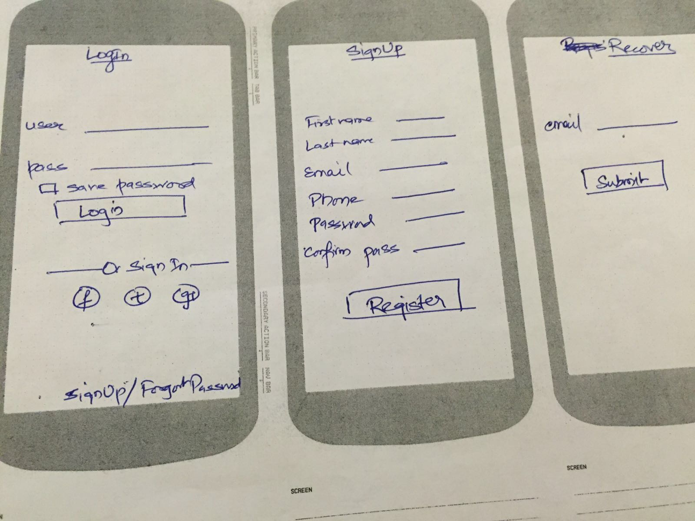
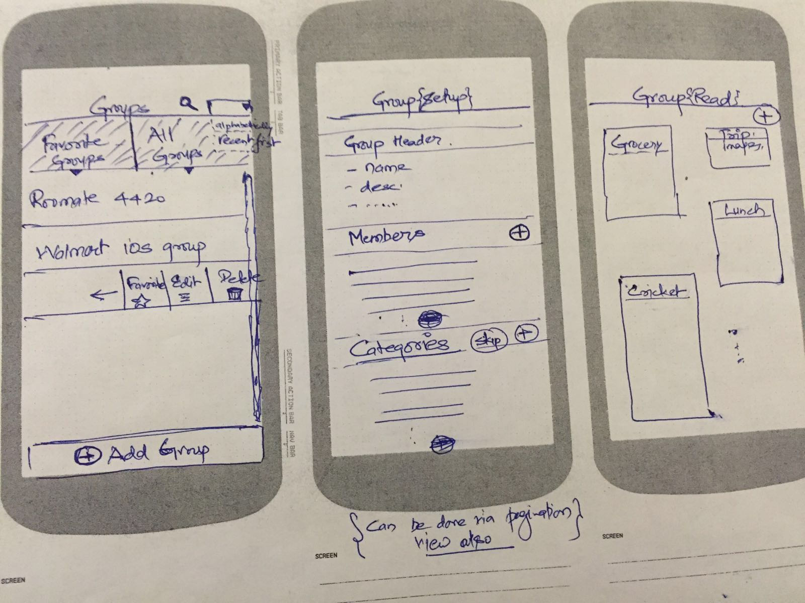
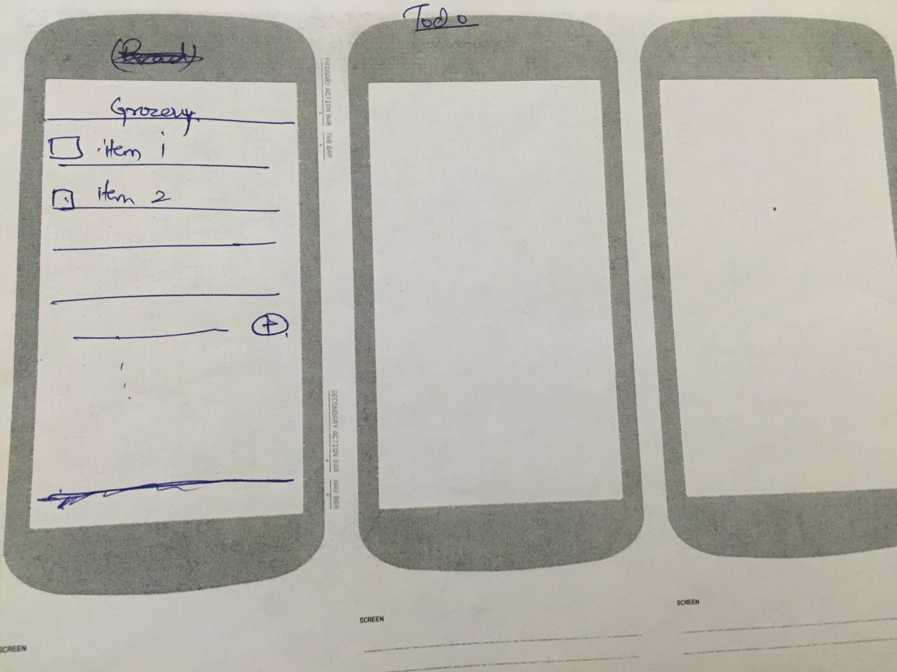
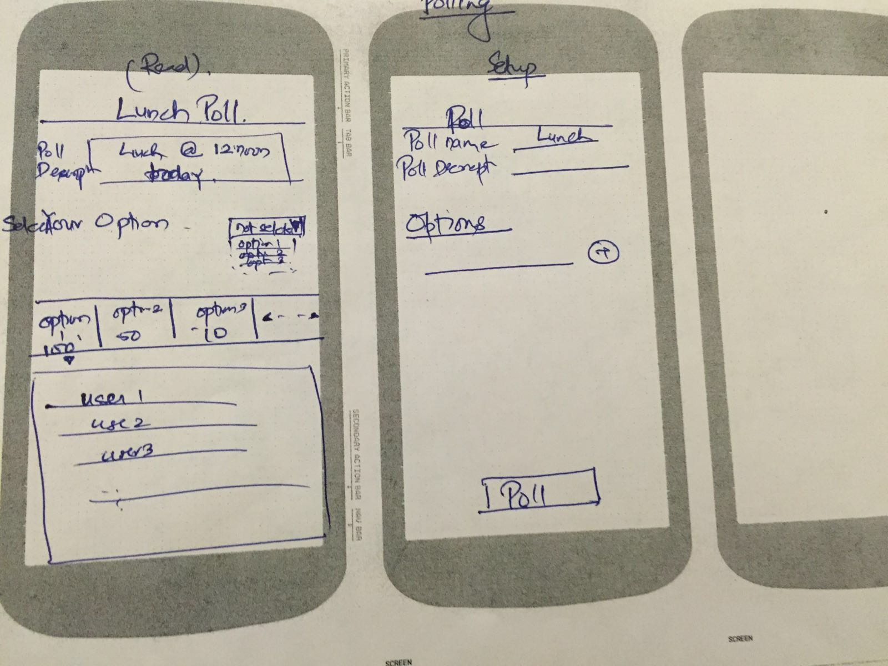

# Project - *GroupIt*

### Problem

Managing day-to-day tasks within groups is a tough problem. Multiple platforms exist today that are focussed on solving specific task.

### Solution

Our solution is trying to solve above problem by reversing the way we thing today. Today, we have multiple platforms and within each platform, we create group. However, with **GroupIt**, we will create groups and then pick the tasks we want to use this group for using the pre-defined set of category templates.

## User Stories

**required**

- [ ] **Login Screen**
    - [ ] Signup Form including user details
    - [ ] Login Form consisting of user credentials
- [ ] **Groups Screen**
    - [ ] List all groups for a user
    - [ ] Support prefix search for groups
    - [ ] Support group sorting
    - [ ] Add a group
        - [ ] Group Details, Adding Categories and Adding Members Screen
    - [ ] Update/Delete a group
    - [ ] Get a group and transition to Group Screen
- [ ] **Group Screen**
    - [ ] Show all categories
    - [ ] Add a category
        - [ ] Get category templates
        - [ ] Transition to Setup category screen
    - [ ] Add/Update/Delete members in a group
    - [ ] Add/Update/Delete a group
    - [ ] Get category details and transition to Read Category Screen
- [ ] **Category Screen**
    - [ ] Shared ToDo
        - [ ] Add/Update/Delete ToDo tasks
        - [ ] Get all ToDo tasks for a category
        - [ ] Pending/Completed State of a ToDo task
    - [ ] Polling
        - [ ] Add/Update a poll and transition to setup poll screen
        - [ ] Get poll details and transition to poll details screen
        - [ ] Delete a poll
    - [ ] Shared Images
        - [ ] Take an image (camera integration)
        - [ ] Upload an image from photo library
        - [ ] Get all images

**optional**

- [ ] **Login Screen**
    - [ ] Login using Fb integration
- [ ] **Timeline Screen**
    - [ ] Show stats from different categories in each group.
- [ ] **Groups Screen**
    - [ ] Favorite a group
- [ ] **Group Screen**
    - [ ] TBD
- [ ] **Category Screen**
    - [ ] Shared ToDo
        - [ ] Get all completed ToDo tasks on demand
    - [ ] Polling
        - [ ] Filtering based on polling status (Yes/No/Maybe/NoRSVP)
    - [ ] Shared Images
        - [ ] Organize photos into albums
        - [ ] Delete/Archive Image
    - [ ] Shared Calendar
        - [ ] Access members' calendar
        - [ ] Show available time of the members
        - [ ] Booking request for a meeting
        - [ ] Accept/Reject meeting request
    - [ ] Shared Ride
        - [ ] Add a ride for all members (can be collaborative cab service or book indivial cab)
    - [ ] Chat
        - [ ] Add a message (owner,text,timestamp)
    - [ ] Finance
        - [ ] Add a bill/recurring bill
        - [ ] Splitwise integration

**additional**

- [ ] **Login Screen**
    - [ ] TBD
- [ ] **Timeline Screen**
    - [ ] TBD
- [ ] **Groups Screen**
    - [ ] TBD
- [ ] **Group Screen**
    - [ ] TBD
- [ ] **Category Screen**
    - [ ] Shared ToDo
        - [ ] TBD
    - [ ] Polling
        - [ ] TBD
    - [ ] Shared Images
        - [ ] TBD
    - [ ] Shared Calendar
        - [ ] TBD
    - [ ] Shared Ride
        - [ ] TBD
    - [ ] Chat
        - [ ] TBD
    - [ ] Finance
        - [ ] TBD

## Wireframes

**Login Screen**
)

**Groups and Group Screen**
)

**Todo Category Screen**
)

**Poll Category Screen**
)

## Video Walkthrough

Here's a walkthrough of implemented user stories:

[TBD]

## License

    Copyright [2016] [Saumeel Gajera], [Rajiv Deshmukh] and [Ankit Jasuja]

    Licensed under the Apache License, Version 2.0 (the "License");
    you may not use this file except in compliance with the License.
    You may obtain a copy of the License at

        http://www.apache.org/licenses/LICENSE-2.0

    Unless required by applicable law or agreed to in writing, software
    distributed under the License is distributed on an "AS IS" BASIS,
    WITHOUT WARRANTIES OR CONDITIONS OF ANY KIND, either express or implied.
    See the License for the specific language governing permissions and
    limitations under the License.
